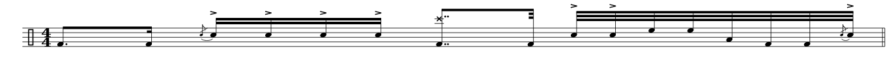
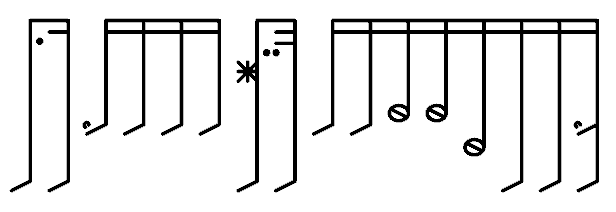
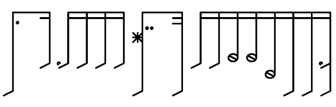

# UltimateDrumScorerPro

_Hey, this app is in the very early stages of development! It is a program to write drum notes in a way I find easier to read._  

The art style is made to look a lot more simplistic and less cluttered than your standard score with staff lines and all that. It also uses many more symbols for different notes, e.g. toms and snares look different.  
Everything is drawn as lines, as if it were a pencil.

At the moment the implemented notes are these.  
  
(the stars being crashes 1 and 2, the circles with lines being toms, the upper single line is a snare, the upper single line with a little hat is a flam snare, and the lower single line is a kick)  

# Examples
## Example 1 - Art style and spacing
_*Note this program is a work in progress and things are set to improve!_  

Say you have [this beat](https://www.mikeslessons.com/groove/?TimeSig=4/4&Div=32&Tempo=80&Measures=1&H=|----------------c---------------|&S=|--------f-O-O-O---------OO-----f|&K=|o-----o---------o------o-----oo-|&T1=|--------------------------oo----|&T4=|----------------------------o---|):  
  
With this program, it would look like this:  
  
But, to make the rhythm more understandable, we can then add spacing, like this:  
  

## Example 2 - Multiple of the same type of note
You can have up to 2 notes per line because otherwise it wouldn't fit (the reason they don't move up or down is because that is harder, and you only have 2 hands anyway).  
  
Which would Crash and Ride, then ride, then ride.