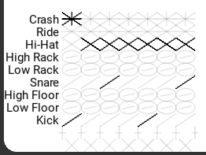
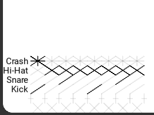
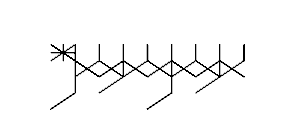
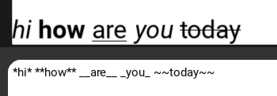

# UltimateDrumScorerPro

_Hey, this app is in the very early stages of development! It is a program to write drum notes in a way I find easier to read._  

The art style is made to look a lot more simplistic and less cluttered than your standard score with staff lines and all that. It also uses many more symbols for different notes, e.g. toms and snares look different.  
Everything is drawn as lines, as if it were a pencil.

### Editing
_Images shown may change - many features are not yet implemented!_

There will be multiple editors that are built to be fast and versatile. I plan on making them highly configurable so users can configure and optimize them (change default notes, spacing, etc).  

This is an example of the first editor I created:  
   
(The crosses under the kick mean to add or remove a section)

I will also add support for custom spacing between notes (at the moment there is none) so you can improve readability for those who find rythm more difficult, or to add slight nuance to how it should be played.  

I also already have a text editor which supports font sizes and configurable markdown.  

#### Other editors
I plan to make one like the editor shown above, except instead of pluses, it has an empty column inbetween.  
I also intend on making on similar to your more standard music program where it handles bars, flags and dots for you (e.g. [Groove Scribe](https://www.mikeslessons.com/groove/)).
